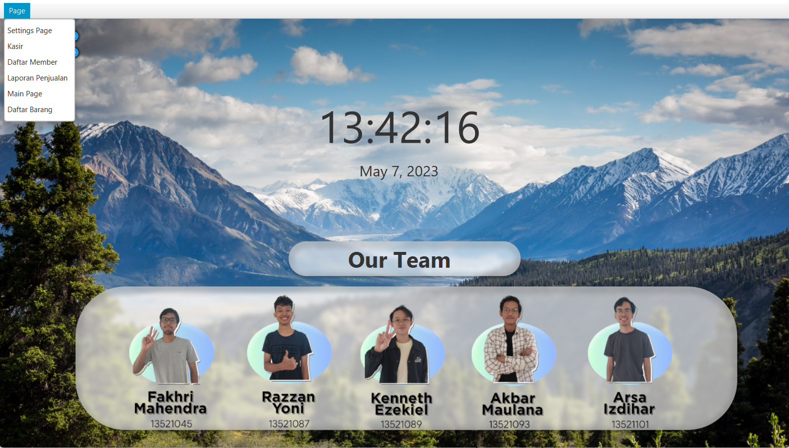
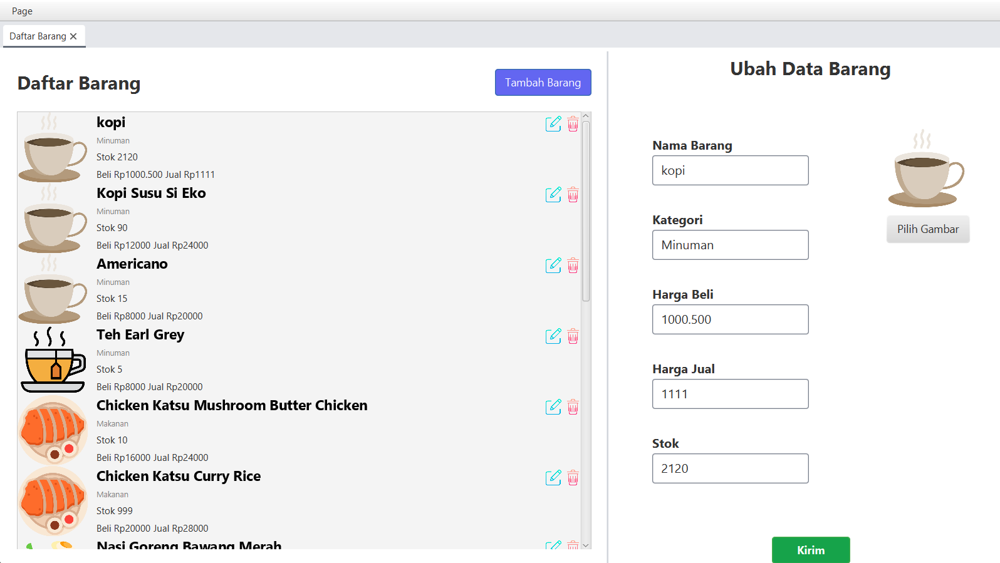
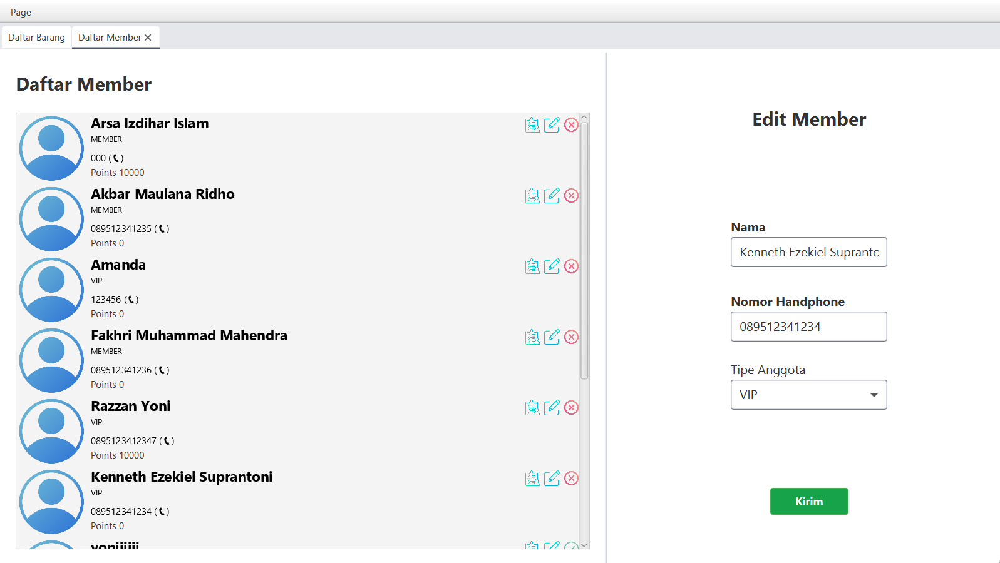
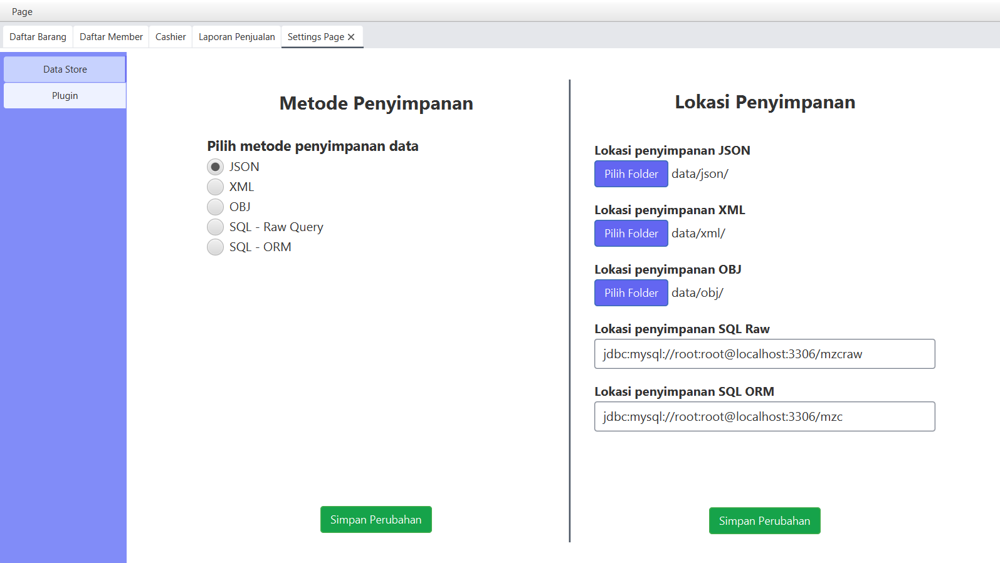
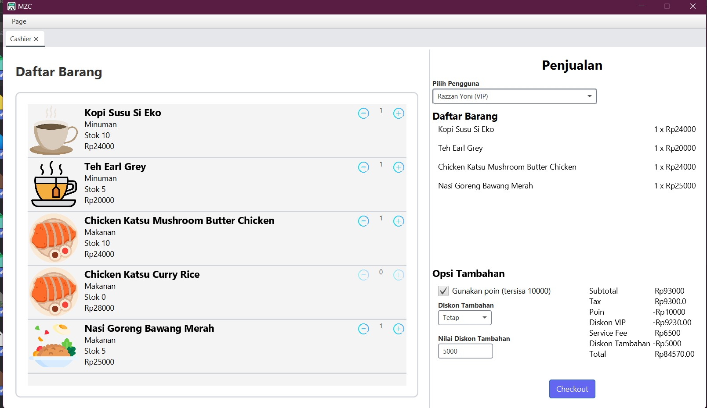

# Tugas Besar 2 Pemrograman Berorientasi Objek

## Table of Contents

- [Tugas Besar 2 Pemrograman Berorientasi Objek](#tugas-besar-2-pemrograman-berorientasi-objek)
    - [Table of Contents](#table-of-contents)
    - [Project Description](#project-description)
    - [General System Description](#general-system-description)
    - [Program Features](#program-features)
    - [Screenshot](#screenshot)
    - [Running The Program](#running-the-program)
        - [Prerequisites](#prerequisites)
        - [How to Compile](#how-to-compile)
    - [Libraries Used](#libraries-used)
    - [Authors](#authors)
    - [Acknowledgements](#acknowledgements)

## Project Description

Projek ini adalah sebuah Tugas Besar untuk Mata Kuliah IF2210 Pemrograman Berorientasi Objek, yaitu pembuatan sebuah
aplikasi Point of Sales (POS) dalam bahasa Java yang diperuntukkan membantu manajemen dari sebuah usaha.

## General System Description

Aplikasi yang kami buat adalah sebuah aplikasi POS (Point of Sales) yang membantu sebuah toko, dengan jenis bisnis yang
beragam seperti restoran, toko, retail, kafe, dan lain-lain, untuk melakukan dan mencatat transaksi yang berhubungan
dengan usahanya. Beberapa fitur dasar yang ditawarkan oleh aplikasi kami adalah manajemen inventaris untuk barang yang
dijual, keuntungannya, dan diskon yang diberikan; manajemen transaksi untuk transaksi dengan pelanggan dan mencatat
riwayatnya; manajemen usaha untuk menghasilkan laporan pembelian (bill) atau laporan penjualan; dan manajemen anggota
alias membership yang dapat mencatat data pelanggan, memberikan reward dan lain-lain. Aplikasi kami juga bersifat
extensible, sehingga disediakan dukungan plugin jika pengguna ingin menambahkan fungsionalitas baru.

Secara umum, aplikasi kami bekerja serupa dengan sebuah web browser, dimana terdapat sebuah sistem Open Tabs bagi
seluruh Tabs/Menu yang sedang terbuka. Untuk membuka Tab, terdapat sebuah page menu yang berisi daftar seluruh Tab yang
tersedia dalam aplikasi. Jika tidak ada Tab yang terbuka, maka Home Page dari aplikasi akan dimunculkan. Terdapat
halaman untuk mengelola dan manajemen produk pada Halaman daftar barang, halaman untuk mengelola member pada Halaman
daftar member, halaman untuk kasir dan pembelian/transaksi pada Halaman Cashier, halaman untuk laporan penjualan pada
Halaman laporan penjualan, dan halaman untuk mengatur aplikasi pada Halaman settings. Secara keseluruhan, aplikasi kami
dapat membantu bisnis meningkatkan kinerja dan efisiensi mereka dalam mengelola dan manajemen bisnis.

## Program Features

* Catchy Home Screen!
* Manajemen Inventaris Barang
* Manajemen Pembeli dan Member
* Manajemen Transaksi
* Kasir
* Laporan penjualan
* Plugin Extensible
* Settings

## Screenshot

## Running The Program

### Prerequisites

1. Maven
2. Java 17 (Temurin Distribution)
3. Ubuntu 20.04
4. Mysql8 (for SQL and ORM Adapter) with database name mzc and mzcraw

### How to Compile

- Clone Repository

  `git clone git@github.com:arsaizdihar/IF2210_TB2_MZC.git`

- Download openjfx 18

    - Download openjfx from this link
      `https://download2.gluonhq.com/openjfx/18.0.2/openjfx-18.0.2_linux-aarch64_bin-sdk.zip`

    - Extract the zip and remember the extracted path

- Compile package using maven in project root folder. This command will compile both main program and plugin files.

  `mvn package`

- Inside app/target folder run

  `
  java \
  --module-path javafx-sdk-18.0.2\lib \
  --add-exports=javafx.base/com.sun.javafx.event=org.controlsfx.controls \
  -jar app-1.0-SNAPSHOT-shaded.jar
  `

- replace javafx-sdk-18.0.2\lib with relative or absolute path to the same folder from previously extracted folder

## Libraries Used

Java Version : 17 (Tamarin)

* OpenJFX 18
* ControlsFX 11
* Bootstrapfx
* JUnit
* Mysql
* GSON
* Hibernate ORM
* Jackson
* HikariCP
* Boxable

## Authors

| NIM      | Name                       |
|----------|----------------------------|
| 13521045 | Fakhri Muhammad Mahendra   |
| 13521087 | Razzan Daksana Yoni        |
| 13521089 | Kenneth Ezekiel Suprantoni |
| 13521093 | Akbar Maulana Ridho        |
| 13521101 | Arsa Izdihar Islam         |

## Acknowledgements

* Projek ini dibuat dalam rangka memenuhi keperluan tugas besar IF2210 Pemrograman Berorientasi Objek, dengan demikian,
  kami berterimakasih banyak pada asisten Lab Pemrograman dan juga dosen pengampu mata kuliah atas tugas besar yang
  telah diberikan
